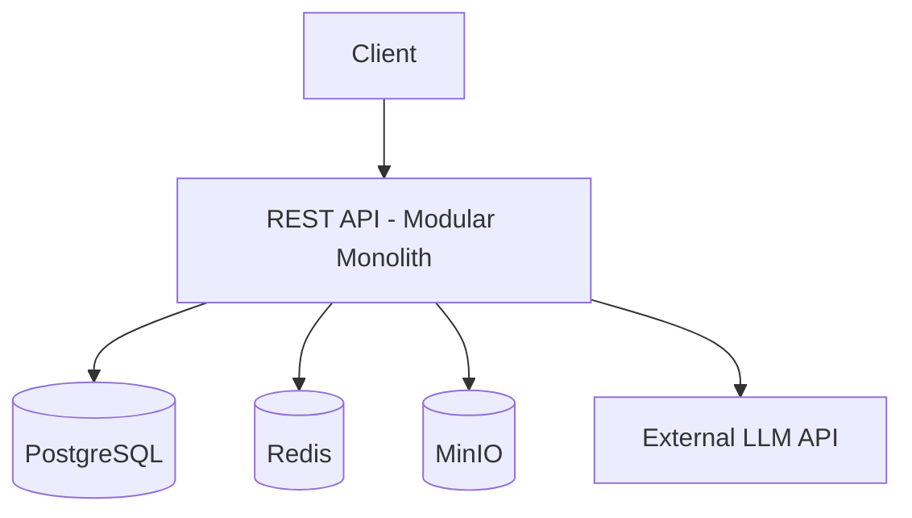
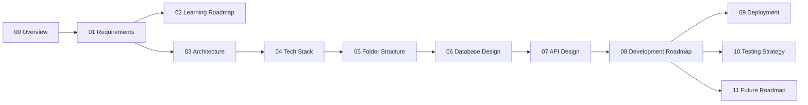

# 12 — Engineering Summary & Starting Point

This page is the entry point for anyone (including future-you) about to start implementing TeleMedHub. It ties together all 12 documents into one operating picture.

---

## 1. Overall Project Architecture

TeleMedHub is a **Modular Monolith**, built with **Clean Architecture** boundaries inside every module, running as a single Go binary against PostgreSQL, Redis, and MinIO.

Every business domain (`auth`, `appointment`, `wallet`, `ai`, etc.) is a self-contained module with its own `handler → service → repository → model` layering, communicating with other modules only through explicit interfaces. This is intentional: it gives the benefits of clear boundaries **now**, and a low-cost path to extracting any module into a standalone microservice **later**, without a rewrite.

## 2. Documentation Flow

## 3. Current Status

| Sprint | Status | Notes |
|---|---|---|
| Sprint 0 (Infra Setup) | ✅ Completed | Project structure, config, slog, readyz/healthz wired and dockerized |
| Sprint 1 (Auth) | ✅ Completed | Hashing Argon2id, JWT + Refresh Token rotation, and endpoints implemented |
| Sprint 2 (User Profiles) | ✅ Completed | Complete details updates for Patient & Doctor, credentials visibility gate & Admin verification audit logging |
| Sprint 3 (Doctor Slots) | ✅ Completed | Availability slots CRUD, overlap interval checking, and booked deletion prevention gates |
| Sprint 4 (Appointment) | ✅ Completed | Race-condition-safe booking transactions using FOR UPDATE row locks, profile gates, and cancellations |
| Sprint 5 (Consultation) | ✅ Completed | State transitions (scheduled -> in_progress -> completed), update notes, and cross-module hooks |
| Sprint 6+ | ✅ Unblocked | Reschedule endpoint, File module, Pharmacy staff role assignment — all now in `07-api-design.md` |

**All 5 architecture review blockers resolved** (see `architecture_review.md` for original findings).

> **Resolved Blockers:**
> 1. ✅ `refresh_tokens` table added to `06-database-design.md` (§4.17)
> 2. ✅ Rate limiting specification added to `07-api-design.md` (§1.4)
> 3. ✅ `idempotency_key` added to `wallet_transactions` in `06-database-design.md` (§4.11)
> 4. ✅ File Management API contract added to `07-api-design.md` (§15)
> 5. ✅ Reschedule endpoint (`POST /appointments/{id}/reschedule`) added to `07-api-design.md` (§5)

| # | Document | Answers |
|---|---|---|
| 00 | Project Overview | Why does this exist? |
| 01 | Product Requirements | What must it do? |
| 02 | Learning Roadmap | How will I learn Go while building it? |
| 03 | System Architecture | How is it structured, and why Modular Monolith? |
| 04 | Tech Stack | What exact technologies, and why? |
| 05 | Folder Structure | How is code organized, and what can't depend on what? |
| 06 | Database Design | What does the data model look like? |
| 07 | API Design | What's the contract with clients? |
| 08 | Development Roadmap | In what order do we build it? |
| 09 | Deployment | How does it run, locally and in production? |
| 10 | Testing Strategy | How do we know it works, and stays working? |
| 11 | Future Roadmap | Where can this go, and is today's design ready for it? |

## 4. Development Workflow

1. Pick the next sprint from `08-development-roadmap.md`.
2. Build inside-out per module, following `05-folder-structure.md`: `model` → `repository` → `service` → `handler`.
3. Write tests as you go, per `10-testing-strategy.md` — never as a separate cleanup pass.
4. Validate the endpoint against its contract in `07-api-design.md` before calling the feature done.
5. Run locally via the Docker Compose setup in `09-deployment.md`.
6. Open a PR — CI runs lint, unit, repository, and API tests automatically.
7. Merge → CI/CD deploys (once Sprint 18 infrastructure exists).

## 5. Architectural Quick Reference

### Security Boundaries
- Passwords: **Argon2id** (time=1, mem=64MB, parallelism=4) — never bcrypt
- JWT: HS256, access token TTL **15 minutes**, refresh token TTL **30 days**
- Refresh tokens: **hashed** (Argon2id) in DB, revocable via `refresh_tokens.revoked_at`
- Rate limits: login 5/min/IP, AI messages 10/min/user, global 100/min/user (Redis counter)
- File uploads: max 10MB, MIME validated server-side, UUID keys (never user-supplied filenames)
- PHI: patient name/ID never sent to external LLM; audit-logged on every read by doctor/admin

### Domain → Go Module Mapping (quick ref)

| Domain | Module(s) | Key Rules |
|---|---|---|
| Identity | `auth`, `user` | `refresh_tokens` table; Argon2id hashing |
| Appointment | `appointment` | Partial unique index; reschedule atomic; refund policy |
| Consultation | `consultation`, `prescription` | `prescription` depends on `consultation.Service` interface only |
| Pharmacy | `pharmacy`, `inventory` | `FOR UPDATE` locking; stock decremented at `processing` |
| Wallet | `wallet` | Append-only ledger; `idempotency_key`; `CHECK balance >= 0` |
| Medical Records | `medical_records` | Every read/write via `shared.AuditService.Log` |
| AI | `ai` | 1 session/patient; 24h auto-close; PHI-stripped prompts |
| Files | `file` | MinIO abstraction; presigned URLs (15min TTL); UUID object keys |
| Notifications | `notification` | Redis Streams; 3 retries; `retry_count`/`last_attempted_at` on `notifications` table |
| Cross-cutting | `shared` | `AuditService`, `Money`, `Pagination`, RBAC middleware |

### Key Business Policies
- **Cancellation refund**: Full refund if cancelled ≥ `APPOINTMENT_CANCEL_CUTOFF_MINUTES` (default 60) before `scheduled_at`; no refund if within cutoff
- **Inventory decrement**: At `processing` status, not at order creation
- **Stock locking**: `SELECT ... FOR UPDATE` on `medicines` during order creation
- **Pharmacy staff**: Privileged role assigned by admin via `POST /admin/users/{id}/roles`; not self-service
- **Doctor verification**: Admin must set `is_credential_verified = true`; patients cannot book unverified doctors (`422 DOCTOR_NOT_VERIFIED`)
- **AI sessions**: Max 1 active per patient; auto-close after 24h inactivity
- **Timestamps**: UTC everywhere (`timestamptz`); no timezone conversion on backend

### Financial Correctness Rules
- All wallet mutations go through `wallet.Service` (never direct repository calls from other modules)
- `Idempotency-Key` header required for client-retry safety on top-up and order creation
- `balance_after` snapshot on every `wallet_transaction` for ledger verification
- `wallet.balance CHECK (balance >= 0)` as final DB-level guard
- Concurrency tests (via testcontainers) required for: double-booking, oversell, concurrent wallet operations

---

## Where to Go From Here

All 12 documents are complete and approved. The next step is **implementation**, starting with Sprint 0 in `08-development-roadmap.md`.

No backend code has been generated as part of this documentation phase, per the original scope. Implementation begins only on your explicit go-ahead.
