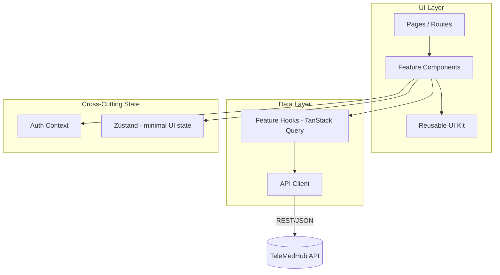
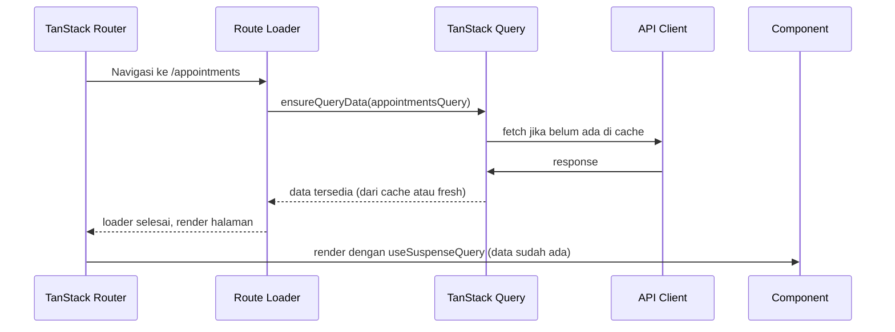
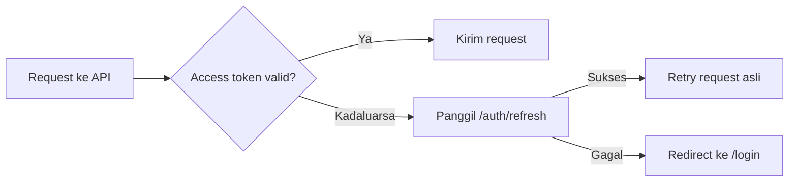

# Frontend 02 — Architecture

## 1. Gaya Arsitektur: Feature-Based, Layered Data Flow

Sejalan dengan Clean Architecture di backend (`03-system-architecture.md`), frontend memisahkan **domain/fitur** dari **layer teknis** — tapi diadaptasi ke pola yang lazim di React modern:

**Arah dependency:** `Pages → Components → Hooks → API Client`. Komponen tidak pernah memanggil `fetch`/API client langsung — selalu lewat hook, supaya caching & error handling konsisten (mirip aturan backend "service tidak pernah dipanggil langsung dari handler modul lain").

## 2. Pemetaan Domain (mengikuti modul backend)

Setiap domain di frontend dipetakan 1:1 ke modul backend, supaya mental model tetap konsisten antara dua sisi:

| Domain Frontend | Modul Backend Terkait |
|---|---|
| `auth` | `auth` |
| `appointment` | `appointment` |
| `consultation` | `consultation` |
| `prescription` | `prescription` |
| `pharmacy` | `pharmacy`, `inventory` |
| `wallet` | `wallet` |
| `medical-records` | `medical_records` |
| `ai-assistant` | `ai` |
| `notification` | `notification` |
| `admin` | `admin` (backend), lintas semua modul untuk read |

## 3. Data Flow: Route → Loader → Query → Component

Pola standar untuk setiap halaman yang butuh data server:

**Kenapa lewat loader, bukan `useEffect` + `fetch` di komponen:** mencegah waterfall (fetch baru mulai setelah komponen mount) dan race condition klasik React. Ini pola yang direkomendasikan TanStack Router + TanStack Query bersama-sama.

## 4. Autentikasi & Otorisasi

Mengikuti kontrak JWT di `07-api-design.md`:

- **Penyimpanan token:** access token disimpan di memori (Context/Zustand), **bukan** `localStorage`, untuk mengurangi risiko XSS. Refresh token disimpan sebagai `httpOnly` cookie kalau backend mendukungnya — kalau tidak, didiskusikan sebagai penyesuaian di `07-api-design.md` sebelum implementasi (ini keputusan yang perlu dikonfirmasi dengan tim backend, bukan diasumsikan sepihak di frontend).
- **Route protection:** `TanStack Router` mendukung `beforeLoad` per route untuk cek auth state + role, redirect ke `/login` kalau tidak memenuhi syarat — dipakai untuk semua route di bawah `/patient`, `/doctor`, `/admin`.
- **Token refresh:** API client punya interceptor yang otomatis memanggil `/auth/refresh` saat menerima `401`, lalu retry request asli sekali. Kalau refresh juga gagal, redirect ke `/login`.

## 5. Reusable Component System

Tiga lapis komponen, dari paling generik ke paling spesifik:

| Lapis | Contoh | Aturan |
|---|---|---|
| **UI Kit** (`components/ui/`) | `Button`, `Input`, `Dialog`, `Badge` | Tidak tahu apa-apa soal domain (tidak ada kata "appointment" di dalamnya). Basis dari shadcn/ui. |
| **Shared Domain Components** (`components/shared/`) | `PatientAvatar`, `StatusBadge` (dipakai lintas domain: appointment, order, prescription semua punya "status") | Tahu sedikit soal domain, tapi dipakai lebih dari satu fitur |
| **Feature Components** (`features/<domain>/components/`) | `AppointmentCard`, `WalletTopUpForm` | Spesifik satu domain, boleh import dari dua lapis di atas, **tidak** diimport oleh domain lain langsung |

**Aturan lintas-fitur:** kalau `wallet` butuh menampilkan status order, dia tidak import komponen dari `features/pharmacy/`. Kalau ada kebutuhan tampilan yang genuinely dipakai berulang, naikkan ke `components/shared/` — pola ini setara dengan aturan `internal/shared` di backend (`05-folder-structure.md`).

## 6. Error Handling

- **Error boundary** di level route (TanStack Router mendukung `errorComponent` per route) — satu fitur error tidak menjatuhkan seluruh aplikasi.
- **Format error API** dari `07-api-design.md` (`{ error: { code, message, details } }`) di-parse oleh API client jadi satu bentuk `ApiError` yang konsisten, dipetakan ke pesan yang ramah pengguna di layer UI — bukan menampilkan `error.message` mentah dari backend ke pengguna.
- **Toast/notifikasi** untuk error non-blocking (mis. gagal refresh notification list), error boundary untuk error blocking (mis. gagal load halaman appointment).

## 7. Kenapa Bukan Next.js / SSR

Konsisten dengan alasan di `04-tech-stack.md` (backend) yang menghindari kompleksitas tak perlu: TeleMedHub adalah aplikasi **behind-login** (bukan situs publik yang butuh SEO), jadi SSR tidak memberi nilai tambah yang sepadan dengan kompleksitas tambahan (server component boundary, hydration mismatch, dsb). SPA murni di atas Vite lebih selaras dengan filosofi "kompleksitas harus didapat, bukan diasumsikan" yang sama dipakai backend untuk menunda Kubernetes/microservices.

Kalau di masa depan ada kebutuhan SEO (mis. landing page publik untuk marketing), itu bisa jadi aplikasi Next.js **terpisah** yang hanya menangani halaman publik — bukan alasan untuk memindahkan seluruh app internal ke SSR.

---

**Dokumen berikutnya:** `03-frontend-folder-structure.md` — struktur folder konkret.
